<!--
作业：
1.在vs中建立工程，修改编译选项，只保留/ZI (调试)和pdb文件路径两个选项。增加禁用安全检查选项（/GS-）
2.编译多个函数调用的实例代码
3.调试运行，观察反汇编、寄存器、内存等几个调试的信息
4.分析函数调用过程中栈的变化，什么是栈帧，ebp在函数调用中的变化以及作用
5.函数局部变量和参数保存位置，访问方式
6.多层的函数调用，栈的变化情况，解释未赋初始值的局部变量的值是如何形成的。
-->

# 逆向工程实验1

## 实验工具

* VS2019

## 参考代码(包含多层函数调用)

``` c
#include <Windows.h>

int sub_function1(){
 return 0;
}

int sub_function2(int a,int b){
 int c = a + b;
 return sub_function1() + c;
}

int main() {
 int haha = sub_function2(1, 2);
 MessageBoxA(NULL, "hello,world", "i am from cuc", MB_OK);
 return 100;
}
```

## 实验问题解答

1. 在vs中建立工程，修改编译选项，只保留/ZI (调试)和pdb文件路径两个选项。增加禁用安全检查选项（/GS-）：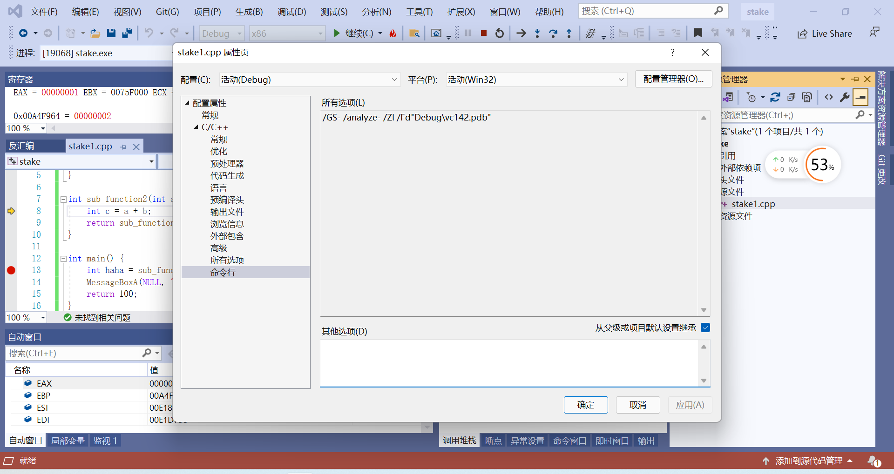

2. 编译多个函数调用的实例代码: 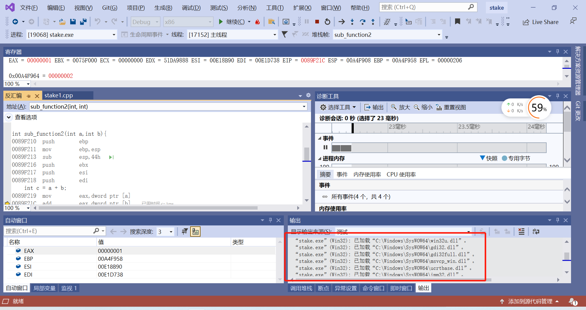

3. 调试运行，观察反汇编、寄存器、内存等几个调试的信息: 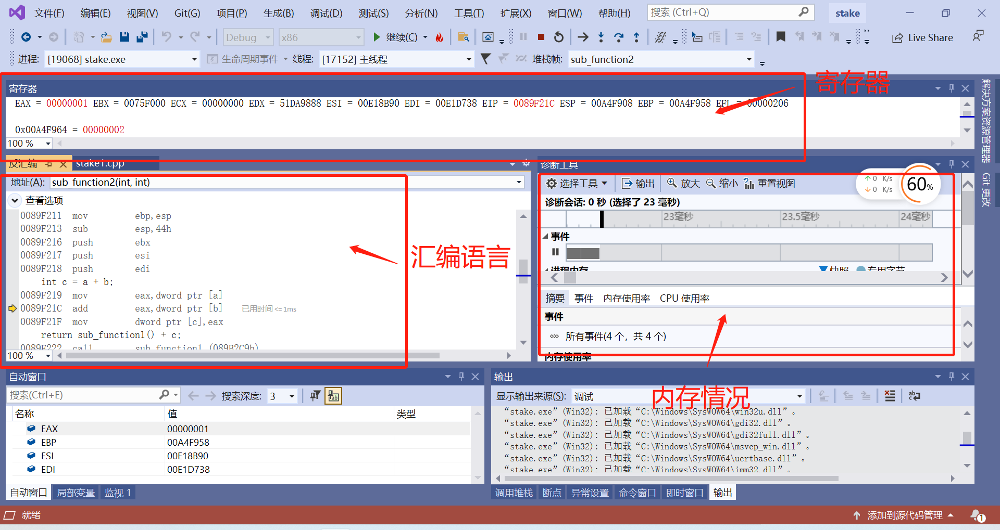
   * 寄存器部分红色表示，出现变化，方便进行比较
   * 反汇编可以看到汇编语言的翻译，旁边的箭头可以表示执行程序断点的位置
   * 内存部分占用情况看旁边的诊断工具，而对应的地址还是要看反汇编左边的地址

4. 分析函数调用过程中栈的变化，什么是栈帧，ebp在函数调用中的变化以及作用
   * 首先查询资料分别得知ebp和esp的概念：
   * esp:放当前栈帧的栈顶，会随着当前函数内栈空间的开辟而变动
   * ebp:存放当前栈帧的栈底，一般在函数内不会对ebp寄存器做变动
   * 然后再连续观察调用两次函数的多次栈的变化情况：
    
    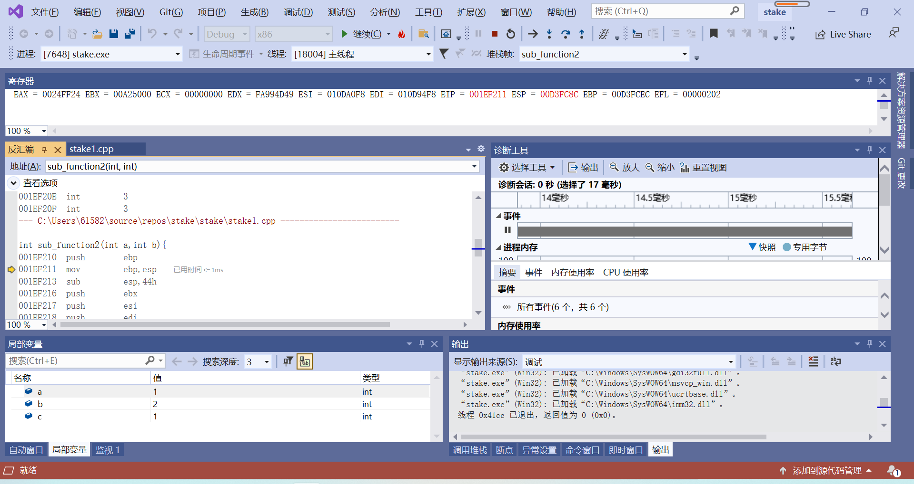
   * 把ebp推入栈中，反而我们会发现esp的值发生了，改变，这里假设他是对应程序的栈帧的顶部，我们继续来看
    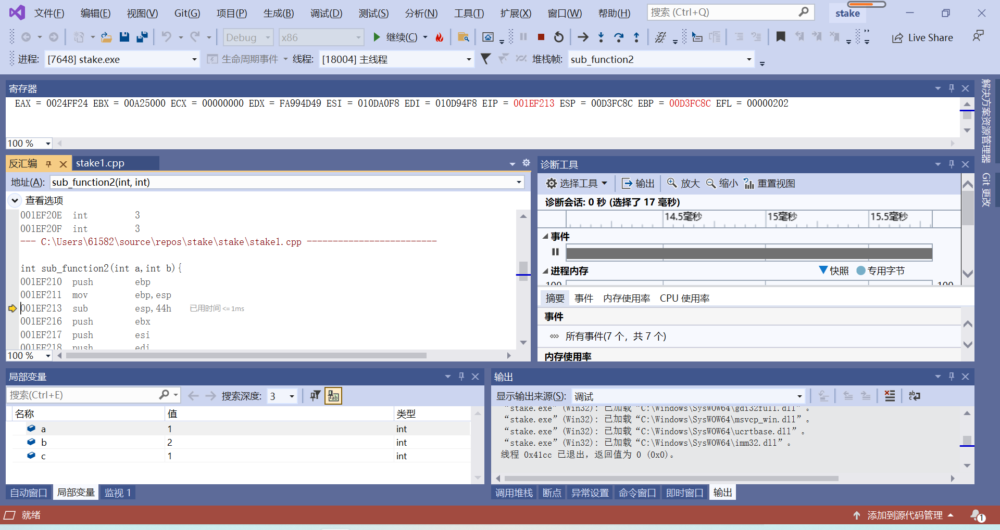
    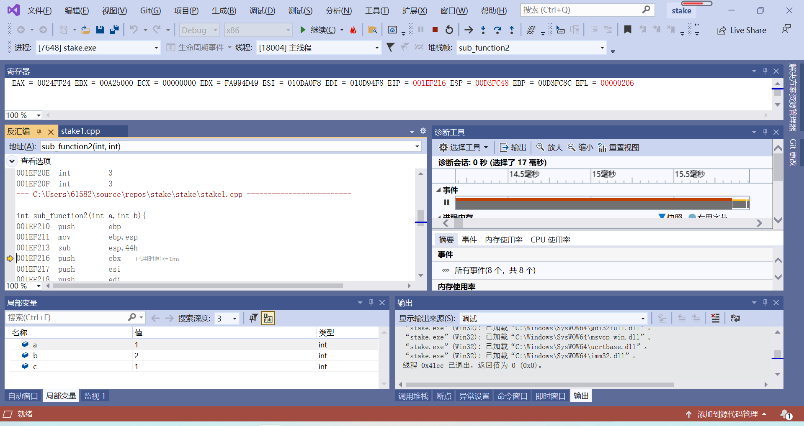
   * 这个时候我们发现，`esp=00D3FC8C` 变为了 `00D3FC48`,ebp变为了`A4F958`;前者是因为`sub  esp,44h`的缘故，后者是因为`mov  ebp,esp`，ebp被赋值了，因为ebp代表的是栈底,然后我接着逐语句分析...这个时候也发现了EIP的作用是是指向语句的地址位置
    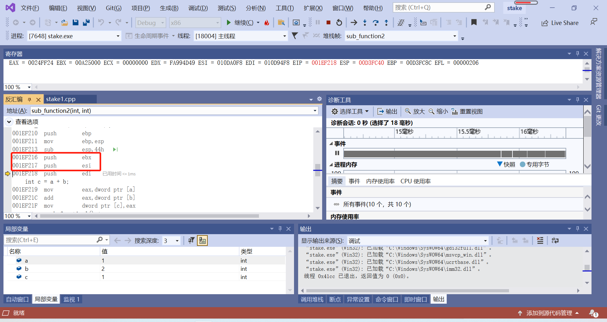
   * 同时，会发现push两个寄存器后，这个esp他会自己自动减少4H，因为它指向的是栈顶的指针
     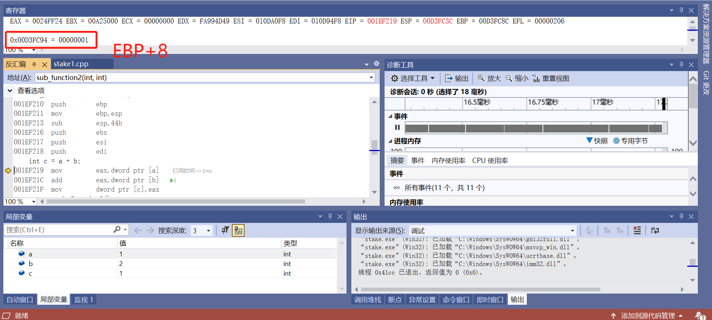
     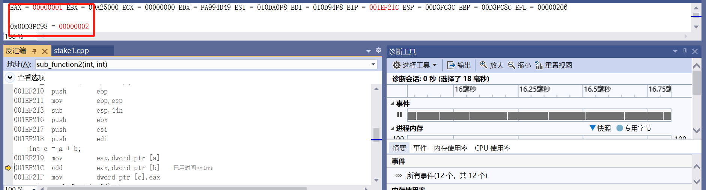
     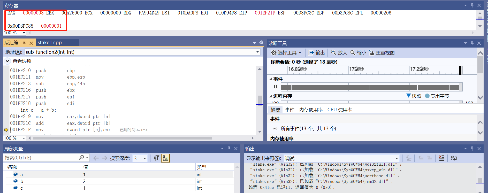
     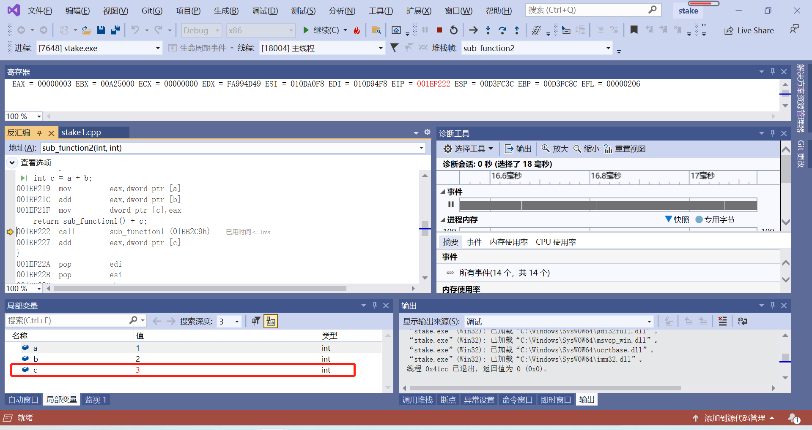
   * 突然发现，后面ebp+8的位置出现了一个多出来的寄存器保存着1这个数值，推测ebp+8之后保存的是我们传进来的参数，继续看之后的变化.发现eax保存了1这个数值，然后在ebp+12的位置保存了2这个数值，继续保存我们传的参数。现在eax开始保存3了，然后在ebp-4的位置保存的是1？（这个答案可能和之前多次实验的结果有关，因为位置的答案我还见过2048）先继续看，发现那个c的取值变成了3，现在我们懂了，ebp-4的位置存的应该是局部变量
   * 是时候总结了，画两张图：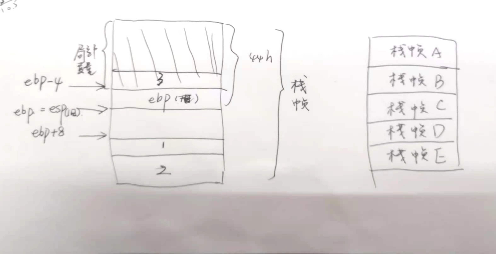
   * 栈帧是由局部变量，临时参数，以及各种指针组成的，在内存中每次调用一次函数，就会构造一个新的栈帧，如右图所示。而ebp的作用在我的分析下，已经很显然了，作为一个基址指针，ebp-4用来存局部变量，ebp+8用来存参数，方便程序的调用。在后面返回函数的时候，同样发挥着作用，还给了esp最开始的值

5. 函数局部变量和参数保存位置，访问方式
   * 这个问题在上面介绍ebp的作用就有提到了，对于保存位置：ebp-4用来存局部变量，ebp+8用来存参数，这个已经用实验验证过了。访问方式，我认为是通过类似`dword ptr [a]`的语句来用指针指向变量们对应的地址实现访问的。

6. 多层的函数调用，栈的变化情况，解释未赋初始值的局部变量的值是如何形成的
     
     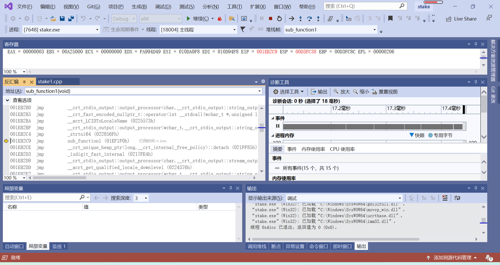
     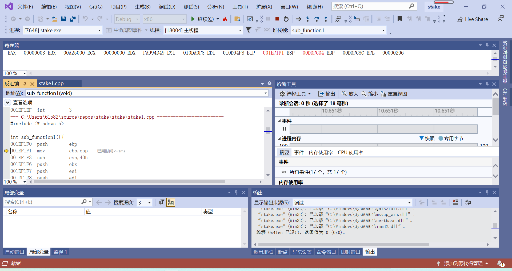
   * 调用新函数的时候，发现我们的栈顶指针esp依然很有规律的减了4，以及`push ebp`的时候也减少了4，后续的与function2类似，每次push寄存器的时候，esp都会减少4，这里不作重复分析。
     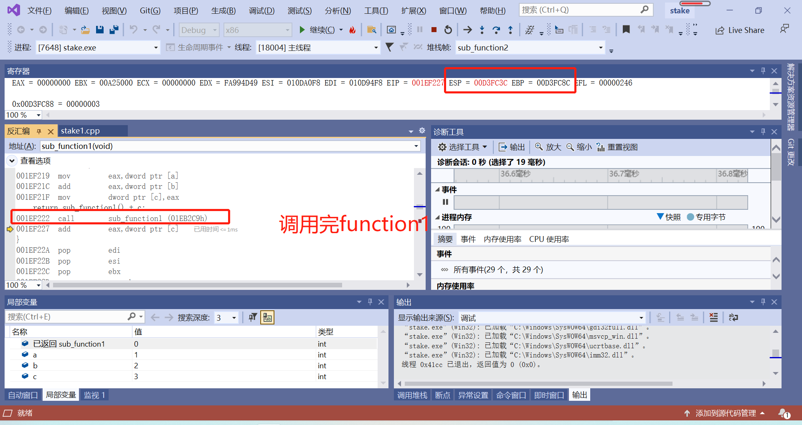
   * 调用完之后又会进行一系列置0退栈等等操作，由于之前`mov ebp esp`的操作，ebp仍然保存着esp的取值，所以在调用完里层的函数之后，esp仍然会回到初始的那个取值。至此，函数调用，我们会发现每次调用一个新的函数，esp依然会减4，就和之前push寄存器一样，调用完后又会进行各种退栈。
   * 现在还剩最后一个问题：未赋初始值的局部变量的值是如何形成的？这个问题其实现在也已经很明了了，定义局部变量，其实就是在栈中通过移动栈指针来给程序提供一个内存空间和这个局部变量名绑定。然后，上一段程序执行完成之后，内存空间没及时释放的话，这段内存空间就会存在在栈上，而栈内存是反复使用的，所以下一次，使用的未赋初值的局部变量，可能就是之前使用过的栈空间上的值（没有被覆盖掉）
    
